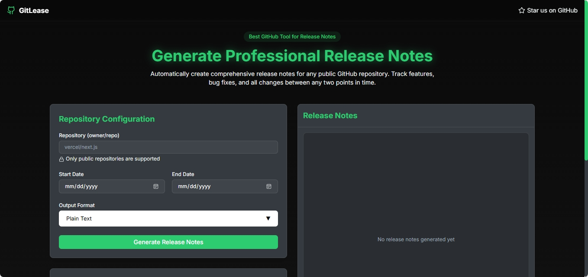

# Gitlease (GitHub Release Notes Generator)

A simple and effective web app built with **Next.js**, leveraging the **GitHub REST API** to generate clean, concise release notes between two Git references or time points. Simply paste the repository URL and let the app do the rest.



## 🚀 Features

* 📥 Input a GitHub repo URL and two tags/commit SHAs/dates
* 🔍 Automatically fetch merged PRs, commits, and authors
* 🧠 Smart filtering for relevant release notes (e.g., skip bot commits)
* 📄 Well-formatted, markdown-style changelog output
* 🌐 No login required — works with a classic GitHub personal access token

## 🛠️ Tech Stack

* [Next.js](https://nextjs.org/)
* [Tailwind CSS](https://tailwindcss.com/)
* [GitHub REST API](https://docs.github.com/en/rest)
* [TypeScript](https://www.typescriptlang.org/)

## 📁 Project Structure

```
brayanj4y-gitlease/
├── app/
│   ├── globals.css
│   ├── layout.tsx
│   ├── page.tsx
│   └── api/
│       └── github-status/
│           └── route.ts
├── components/
│   ├── brutalist-*.tsx
│   ├── modern-*.tsx
│   ├── release-notes.tsx
│   ├── theme-provider.tsx
│   └── ui/
│       ├── *.tsx
├── hooks/
│   ├── use-mobile.tsx
│   └── use-toast.ts
├── lib/
│   ├── github.ts
│   └── utils.ts
├── public/
└── styles/
    └── globals.css
```

## 🔑 Setup Instructions

1. Clone the repo:

```bash
git clone https://github.com/brayanj4y/gitlease.git
cd gitlease
```

2. Install dependencies:

```bash
npm install --legacy-peer-deps
```

3. Create a `.env.local` file with:

```env
GITHUB_TOKEN=your_personal_access_token
```

4. Start the dev server:

```bash
npm run dev
```

Open `http://localhost:3000`.

## 🧪 Usage

1. Paste your GitHub repository URL.
2. Enter the **start** and **end** tags, SHAs, or date ranges.
3. Click **Generate**.
4. Copy or download the generated markdown release notes.

## 🧾 Example Output

```
## 📦 Release Notes (v1.2.0 → v1.3.0)

### ✨ Features
- Add new settings panel (#42)

### 🐛 Bug Fixes
- Fix typo in docs (#39)

### 🧰 Maintenance
- Upgrade dependencies (#41)
```

## 📄 License

[MIT](./LICENSE)

---

Built with 🛠️ by [@brayanj4y](https://github.com/brayanj4y)
